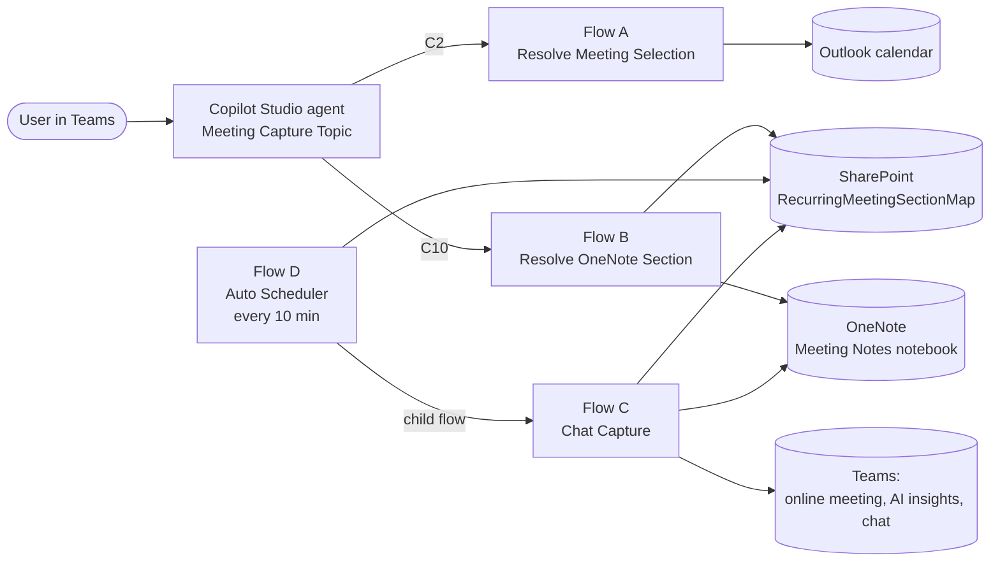

# Architecture — Teams → OneNote Meeting Capture

**Status:** Draft, 22 Sep 2026. Describes the system as built, not as originally briefed.
**Repo:** `Crox2310/Teams-OneNote-Meeting-Capture` · working folder `12-phase-2-validation/`
**Scope:** One Copilot Studio agent, four Power Automate flows, one SharePoint list, one OneNote notebook.

This document is the stable "how it fits together" reference. Point-in-time state lives in `CURRENT-STATE.md` and the dated handover files; exact action values live in the known-good-values references.

---

## 1. Purpose

Give every Teams meeting a OneNote page without manual effort:

1. **Before or during** the meeting, the user asks the agent in Teams to set up notes for a meeting. The agent finds the meeting in Outlook and creates (or reuses) a templated OneNote page in the right section.
2. **After** the meeting, a scheduler fills the page with the Teams Copilot recap (if one exists) and the meeting chat, with no user action.

---

## 2. System context



There are two independent paths that meet at the SharePoint mapping row:

| Path | Trigger | Flows | Writes |
|---|---|---|---|
| **Set-up** (interactive) | User message to the agent | Topic → A → B | OneNote page skeleton + mapping row |
| **Fill** (automatic) | Recurrence, every 10 min | D → C | Recap + chat into the page; `ChatCaptured = true` |

The mapping row is the contract between the two paths. Flow C never creates pages; Flow B never reads Teams content.

---

## 3. Components

### 3.1 Copilot Studio agent — Meeting Capture Topic

The conversational front end. Owns all user interaction; the flows are stateless.

- **C2** calls Flow A with a date context (default today). Always sends `text_1 = "NONE"`, so Flow A's selection-mode branch (FA15–FA26) is never used — the Topic resolves the chosen candidate itself via `ParseJSON(Topic.CandidatesJson)`.
- Handles navigation: previous/next day (P/N), jump to a typed date (C6C_Check_Date), cancel. Zero-match days re-prompt rather than dead-ending.
- **C10** calls Flow B with the selected meeting.
- Routes on Flow B's `OutStatus` (`SUCCESS` → confirmation with page link; otherwise C12 error / stale-mapping message).
- The agent-level "tool" route to Flow A is disabled (it raised `InvalidPropertyPath`); the Topic calls the flows directly.

**C10 → Flow B contract**

| Input | Content |
|---|---|
| `text` | IsRecurring (`"true"`/`"false"`) |
| `text_1`, `text_2` | Meeting title, SeriesMasterId (see known-good values for exact order) |
| `text_3` | Invite body (Teams boilerplate cut at the first `____` divider) + `\|\|\|\|` + OnlineMeetingUrl |
| `text_4` | CalendarEventId (stored as `MeetingId`) |
| `text_5` | OccurrenceDate, `yyyy-MM-dd` |
| `text_6` | EndTime, UTC ISO 8601 |
| `text_7` | Always `""` — retained only to satisfy the schema (see §7, ContentValidationError) |

### 3.2 Flow A — `PA - Meeting Capture - A - Resolve Meeting Selection`

Reads the user's primary Outlook calendar for one day and returns candidate meetings.

- Filters out holiday/leave and all-day noise (FR-02), orders candidates chronologically (FR-01).
- Returns `MatchCount`, `CandidateList` (display text), `CandidatesJson` (structured), and for the single-match case the resolved meeting fields directly.
- Per candidate: title, CalendarEventId, SeriesMasterId, IsRecurring, OnlineMeetingUrl, BodyPreview, EndTime.
- **OnlineMeetingUrl fallback:** Graph's structured `onlineMeeting` property is empty for some invite types, so Flow A extracts the join link from the BodyPreview `href` when needed (FA20D–F, FA29D–F).
- **EndTime:** taken from the V4 connector's flat `end` string, which is UTC (`coalesce(item()?['end'], '')`). Do not use `endWithTimeZone` (wrong offset) or `end/dateTime` (property selection fails on a string).

### 3.3 Flow B — `PA - Meeting Capture - B - Resolve OneNote Section`

Decides where the page goes, creates or reuses it, and writes the mapping row.

**Section rules**

| Meeting type | Section | Page title |
|---|---|---|
| Recurring | One section per series, named `Mtg - <title>` (43-char cap). Planned rename to `Rec - ` — same length, so truncation maths is unchanged. | `<title> - <d MMM yyyy>` |
| One-off | Fixed **One-Off Meetings** section inside the **One Off Meeting** section group (fixed `SectionPagesUrl`, no lookup). | `<title> - <d MMM yyyy>` |

**Decision flow (simplified)**

1. `Get_items` on the mapping list, then filter in-flow: recurring by SeriesMasterId + OccurrenceDate, one-off by MeetingId + OccurrenceDate (OF01).
2. **Mapping exists** → reuse the stored section; confirm the page still exists via a live page lookup in the section (Bug 9 workaround — the stored `PageSelfUrl` is not trusted on its own); append if appropriate.
3. **No mapping** → resolve or create the section (recurring) or use the fixed One-Off section; `CreatePageInSection` with the skeleton; set the title via `UpdatePageContent target:title action:replace`; write the mapping row (OF09 gate).
4. Map `varPageAction` (Created / Updated / ExistsNoCreate) to `OutStatus` (`SUCCESS`, else `ERROR`) and return it with the page link.

Per-occurrence pages for recurring meetings (one page per date, not one page per series) — see `design-amendment-2026-08-20-per-occurrence-recurring-pages.md`.

### 3.4 Flow D — `PA - Meeting Capture - D - Auto Scheduler`

Polls for captured-but-unfilled meetings and fires Flow C once each meeting has ended.

- **Recurrence** every 10 min, run concurrency 1.
- **FD01** `varOffsetMinutes` — wait after meeting end before filling (target 30; gives Teams Copilot time to publish the recap).
- **FD03** Get mapping rows where `OccurrenceDate` is today or yesterday (UK local date), top 50.
- **FD04** recurring rows: `ChatCaptured` not true, SeriesMasterId present, EndTime present.
  **FD04b** one-off rows: SeriesMasterId empty, MeetingId present, EndTime present.
  **FD04c** union of both.
- **FD06** for each row (concurrency 1): **FD06c** `ticks(utcNow()) >= ticks(addMinutes(EndTime, varOffsetMinutes))` → **FD06d** run Flow C as a child flow.

End times come from the mapping row, not the calendar. Calendar lookups were abandoned: the connectors available don't return `seriesMasterId`, and meetings organised by shared accounts don't appear in the user's primary calendar at all.

### 3.5 Flow C — `PA - Meeting Capture - C - Chat Capture`

Fills an existing page with the Copilot recap and the meeting chat.

**Trigger** (PowerApps V2 — required for child-flow calls)

| Input | Content | Required |
|---|---|---|
| `text` | SeriesMasterId (empty for one-offs) | yes |
| `text_1` | MeetingTitle | yes |
| `text_2` | OccurrenceDate `yyyy-MM-dd` | yes |
| `text_3` | AllowFallback | no |
| `text_4` | MeetingId (one-offs) | no |

**Sequence**

1. **FC01** find the mapping row — SeriesMasterId + OccurrenceDate, or MeetingId + OccurrenceDate when SeriesMasterId is empty. Extract JoinUrl and page id.
2. **FC05** `GetOnlineMeeting` by JoinUrl (shared by both branches below).
3. **Recap branch (FC05a–FC05t):** `ListAiInsights` → filter to the target OccurrenceDate → take `last()` of the matches (FC05f; the latest entry is the complete one, earlier entries can be partial snapshots) → `GetAiInsight` → Select meeting notes and action items into HTML rows → `UpdatePageContent` append to the Meeting Notes slot.
4. **Chat branch (FC06–FC14):** chat thread from the online meeting → real messages only → that occurrence's messages → select speaker/time/body → sort by time → HTML → append to the Chat Transcript slot. Runs on every capture, not only as a fallback.
5. **FC22 / FC05u** set `ChatCaptured = true` on the mapping row.
6. **Respond** to the parent flow (required for child-flow use).

### 3.6 PA - Scratch Diagnostics

Not part of production. The established place to prove WDL expressions and connector behaviour before touching A–D.

---

## 4. Data model — `RecurringMeetingSectionMap`

SharePoint site `jsainsbury.sharepoint.com/sites/coplt`, list id `186b3c9f-e758-4e85-83d5-685946614a0a`. One row per **occurrence** (recurring) or per **meeting** (one-off). Despite the name, it holds one-off rows too.

| Column | Type | Written by | Read by | Notes |
|---|---|---|---|---|
| Title / MeetingTitle | Text | B | C, D | |
| SeriesMasterId | Text | B | B, C, D | Empty for one-offs |
| MeetingId | Text | B | B, C, D | Outlook CalendarEventId; one-off key |
| OccurrenceDate | Text | B | B, C, D | `yyyy-MM-dd`. Text, not Date |
| EndTime | Text | B | D | UTC ISO 8601 |
| JoinUrl | Text | B | C | Teams join link; required for FC05 |
| SectionPagesUrl | Text | B | B | Graph section pages-collection URL (real section id) |
| PageSelfUrl | Text | B | B, C | Graph page self-link (real page id) |
| PageWebUrl | Text | B | B → agent | Browser deep link (`wd=target(...)`, client-side ids) |
| SectionId, SectionSelfUrl | Text | — | — | Present but not reliably populated |
| ChatCaptured | Yes/No | C | D | Default No. Set once, never cleared by the system |
| iCalUId | Text | — | — | Added during the calendar-matching attempt; unused |

**Keys:** recurring = SeriesMasterId + OccurrenceDate; one-off = MeetingId + OccurrenceDate.

---

## 5. OneNote

- **Notebook:** `Meeting Notes` in `…/Master Archive Folder/Meeting Notes` on the user's OneDrive.
- **Page template** — created by Flow B, headings only (placeholder text can't be removed by the connector later):

  ```html
  <p><a href="{join url}">Join Teams meeting</a></p>   <!-- omitted if no URL -->
  <div data-id="mynotes"><h2>My Notes</h2></div>
  <div data-id="notes"><h2>Meeting Notes</h2></div>     <!-- Flow C: Copilot recap -->
  <div data-id="chat"><h2>Chat Transcript</h2></div>    <!-- Flow C: chat -->
  <div data-id="details"><h2>Meeting Capture</h2>{invite body}</div>
  ```

- **Write model is append-only.** The connector supports `append` into a `data-id` div but rejects `replace` on divs and paragraphs. Re-running Flow C for the same occurrence stacks a second block; `ChatCaptured` is what prevents that. Pages created before the template have no slots; Flow C falls back to a `body` append.
- HTML must be passed via expression. Anything typed into the connector's rich-text box is escaped as literal text.

---

## 6. Key design decisions

| Decision | Why | Record |
|---|---|---|
| Split interactive set-up (A/B) from automatic fill (C/D) | Protect the validated A/B baseline; post-meeting content isn't available at set-up time | `design-flow-c-chat-transcript-capture.md` |
| Topic owns conversation state; flows are stateless | Copilot Studio handles re-prompting and navigation; flows stay testable in isolation | `design-v5-ux-rebuild-2026-06-27.md` |
| Per-occurrence pages for recurring meetings | One page per series overwrote history (BUG-01) | `design-amendment-2026-08-20-…` |
| Teams Copilot AI insight instead of a custom AI step | Native `shared_teams` connector, no Azure/admin access needed, already structured | 15–16 Sep sessions |
| Phase 2 roadmap dropped (chat AI pass, transcripts, AI review of pages) | Recap covers summarisation; transcripts are tenant-blocked | 16 Sep scope decision |
| EndTime stored on the mapping row; no calendar lookup in D | Calendar connectors don't return `seriesMasterId`; shared-account meetings invisible | 17–18 Sep sessions |
| One-offs to a single fixed section | Removes per-meeting section creation and the unreliable D2 branch | `weekend-build-plan-2026-09-19.md` |
| `ChatCaptured` flag, no rerun-and-replace | Replace isn't supported by the connector; a flag is simple and safe | 1 Sep, 18 Sep proofs |
| Prefer expression edits over adding/moving/deleting actions | Structural edits reliably trigger the value-wipe corruption | `analysis-2026-09-19-end-to-end-review.md` |

---

## 7. Constraints

### Tenant
- **HTTP with Microsoft Entra ID** — blocked by DLP.
- **Transcripts** — `GraphAccessToTranscriptsDisabled` tenant-wide.
- **Plain HTTP connector** — Premium; not relied on.
- **Teams "Send a Microsoft Graph HTTP request"** — allowlisted to channels/chats/onlineMeetings only; no calendar.

### Platform
- **Value-wipe corruption.** SetVariable/InitializeVariable values (and occasionally other fields) blank en masse, sometimes from just opening the Designer. A present-but-empty `"value": ""` variant is invisible to Flow Checker. Recovery: restore from known-good values. Brief: `microsoft-discussion-brief-corruption-bug.md`.
- **Designer async load.** Fields can show empty for several seconds after opening; wait before judging corruption.
- **Child flows** need a PowerApps V2 trigger, a Respond action, and Run-only-user connections set to "Use this connection".
- **Connector envelope.** Some connectors unwrap the HTTP envelope in expressions even though the run viewer shows it — e.g. `body('FC05g_Get_AI_Insight')?['meetingNotes']`, not `?['body']?['meetingNotes']`.
- **Graph chat ordering.** Messages return out of order despite `$orderby`; sort after Select.
- **Copilot Studio input validation.** URLs with `% ? = & { }` in a flow input raise `ContentValidationError`; the join URL is therefore carried inside `text_3`.
- **Removing a trigger input** drops the flow's tool/reference in Copilot Studio; it has to be re-linked.
- **Publish before testing.** The agent and child-flow calls run the published version.

---

## 8. Operating model

- **Session start:** Flow Checker across A–D and the Topic; spot-check key values in Code view against the known-good references.
- **After any structural edit:** save → close/reopen → Code-view check → publish.
- **Evidence first:** Peek Code and run history outrank the canvas and assumptions.
- **Reference docs:** `known-good-values-master-reference.md` (B), `known-good-values-flow-a-reference.md` (A), `known-good-values-addendum-2026-09-18.md`, plus the dated `flow-reference-*` snapshots for C and D.
- **Handover:** dated `handover-YYYY-MM-DD-*.md`; `CURRENT-STATE.md` is the index; `amendment-log.md` records changes.

---

## 9. Known gaps (architectural, not session bugs)

- **Mapping list growth.** Flow B's `Get_items` uses `$top 500` with no source filter; lookups will miss once the list passes that. Fix: OData `$filter` at source.
- **Stale rows.** A failed Flow B run can leave a skeleton row that blocks re-capture (UJ3b).
- **No re-fill.** Once `ChatCaptured` is true the occurrence is never revisited, even if the recap arrived late.
- **Late recap.** If Flow C runs before the recap exists, the page gets chat only. The offset is the only mitigation.
- **Single user.** Everything runs under one person's connections and calendar.
- **Dead paths.** Flow A selection mode (FA15–FA26), the Flow B D2 branch, `Compose_SafeSectionName_D2`.

---

## 10. Open items

Bugs, verifications and improvements are tracked in `BACKLOG.md`. A few statements in this document depend on items there being confirmed:

- Flow B's JoinUrl source for one-off rows (BL-02)
- Flow D's offset value (BL-04)
- Flow C's `#notes` / `#chat` slot targets and whether the AllowFallback gate remains (BL-05)
- C10 input order for `text` / `text_1` / `text_2` (BL-18)
- Whether the `Mtg -` → `Rec -` rename has been done (BL-09)

Update this document when any of those close.
